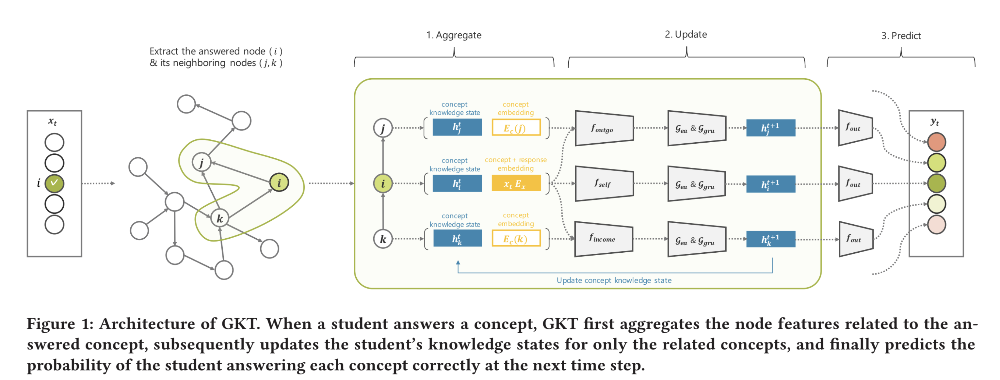

# GKT
The implementation of the paper [Graph-based Knowledge Tracing: Modeling Student Proficiency Using Graph Neural Network](https://dl.acm.org/doi/10.1145/3350546.3352513).

The architecture of the GKT is as follows:



## Setup

To run this code you need the following:

- a machine with GPUs
- python3
- numpy, pandas, scipy and torch packages:
```
pip3 install numpy pandas scipy sklearn torch
```

## Training the model

Use the `train.py` script to train the model. To train the GKT model on ASSISTments2009-2010 skill-builder dataset, simply use:

```
python3 train.py --data-file=skill_builder_data.csv --model=GKT --graph-type=Dense
```

We also provide the baseline, i.e. Deep Knowledge Tracing(DKT) for performance comparison. To train the DKT model on ASSISTments2009-2010 skill-builder dataset, simply use:

```
python3 train.py --data-file=skill_builder_data.csv --model=DKT
```

You might want to at least change the `--data_dir` and `--save_dir` which point to paths on your system to save the knowledge tracing data, and where to save the checkpoints.
